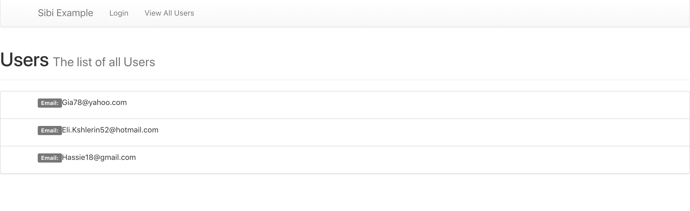
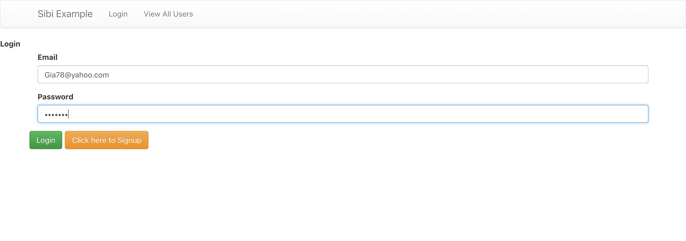
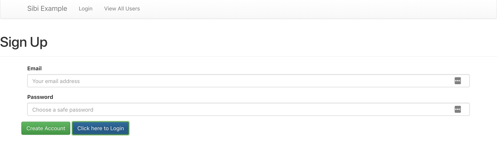
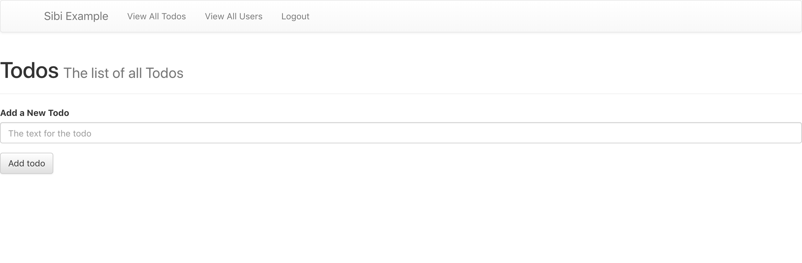
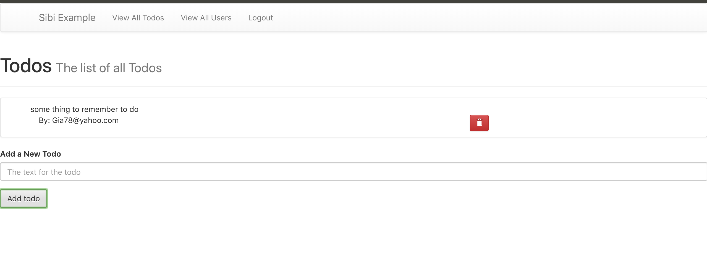
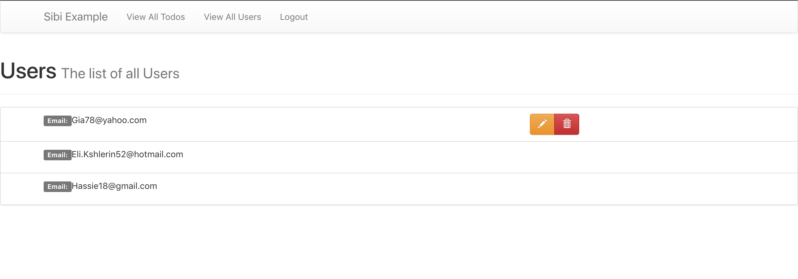
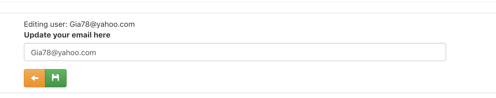

# Sibi Example

### Description
Full stack todo app with basic authentication.
Technologies Used:
- ***React*** - For the client side app
- ***GraphQL*** - For client <-> server data exchange
- ***MongoDB*** - For persisting data
- ***Faker*** - For dummy user creation
- ***Apollo*** - For data management on the client
- ***`graphql-yoga` & `create-react-app`*** - For easy setup
- ***Docker & Docker Compose*** - For easy deployment

---
### Default Users

To generate some fake user emails when the DB User table is empty I've used the [`faker`](https://github.com/marak/Faker.js/) npm package.

The default password is `'foo-bar'` when env variable `DEFAULT_PASS` is empty.

---
### Running The App

To run the app you can use either `docker-compose up` or
run a local instance of MongoDB and use the `yarn start` command.
In either case you can open `http://localhost:3000` in your browser to view the React client.

To view the GraphQL playground go to `http://localhost:9090`

> *You need to make sure the MongoDB instance is running before the server starts.*
>
> *If you run into issues you can use `docker-compose up -d mongodb` before
running `docker-compose up`.*

---
### User List
When you first open the page you'll see a user list:

---
### Login & Signup

You can click the login tab in the navbar
and login with one of the emails given and the default password.

You can also click the blue button to switch between login and signup

---
### Todo List

After logging in you'll be directed to a todo list.
Here you can add and delete todos.

---
### Authenticated User List

Once logged in you'll see a user list with options to edit and delete your user.
> When you delete your user you will be logged out and your todos will be deleted.

---
### Editing a User

Click the pencil to edit the user email and save with the floppy disk icon.

