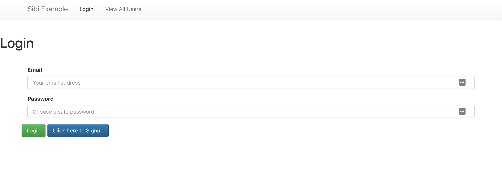

# Sibi Example

### Description
Full stack todo app with basic authentication.
Technologies Used:
- ***React*** - For the client side app
- ***GraphQL*** - For client server data exchange
- ***MongoDB*** - For persisting data
- ***Faker*** - For dummy user creation
- ***Docker & Docker Compose*** - For ease of deployment

### Default Users

To generate some fake user emails when the DB User table is empty I've used the [`faker`](https://github.com/marak/Faker.js/) npm package.

The default password is `'foo-bar'` when env variable `DEFAULT_PASS` is empty.

### Running The App

To run the app you can use either `docker-compose up` or
run a local instance of MongoDB and use the `yarn start` command.
In either case you can open `http://localhost:3000` in your browser.

> *You need to make sure the MongoDB instance is running before the server starts*

When you first open the page you'll see a user list:

You can click the login tab in the navbar
and login with one of the emails given and the default password.

Once logged in you'll see a user list with options to edit and delete your user.
> When you delete your user you will be logged out and your todos will be deleted.

Click the pencil to edit the user email and save with the floppy disk icon.

You can add and view todos by clicking the View All Todos tab

